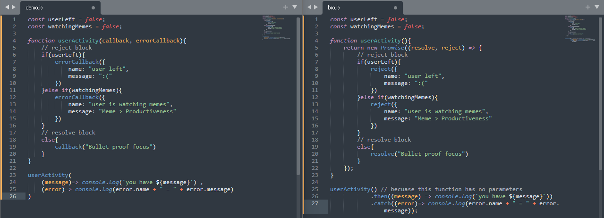

1. First Phase Syntax  
```javascript
let p = new Promise((resolve, reject) => {});
// resolve & reject are function, making Promise higher older function
```  
2. Second Phase Syntax  
```javascript
let p = new Promise((resolve, reject) => {
    // something
    if(true){
        resolve("Success"); // paramets may vary
    }
    else{
        reject("Failed");   // paramets may vary
    }
});
```  
3. Third Phase Syntax  
```javascript
let p = new Promise((resolve, reject) => {
    // something
    if(true){
        resolve("Success"); // paramets may vary
    }
    else{
        reject("Failed");   // paramets may vary
    }
});

// decides which block does what?
p.then((varibleName)=>{ `resolve block` })
.catch((varibleName)=>{ `reject block` })
```  

## practical :  
```javascript
let p = new Promise((resolve, reject) => {
    let a = 1 + 1;
    if(a === 2){
        resolve("Success");
    }else{
        reject("not success");
    }
});

p.then((message)=>{ 
    console.log(`Operation is ${message}`);
}).catch((message)=>{
    console.log(`Operation is ${message}`);
})
```  
#### Output:  
```vbnet
$ node Demo.js 
Operation is Success
```  

## Promise helps us with callback hell  
without Promise  
```javascript
const userLeft = false;
const watchingMemes = false;

function userActivity(callback, errorCallback){
    // reject block
    if(userLeft){
        errorCallback({
            name: "user left",
            message: ":("
        })
    }else if(watchingMemes){
        errorCallback({
            name: "user is watching memes",
            message: "Meme > Productiveness"
        })
    }
    // resolve block
    else{
        callback("Bullet proof focus")
    }
}

userActivity(
    (message)=> console.log(`you have ${message}`) ,
    (error)=> console.log(error.name + " = " + error.message)
)
```  
with Promise  
```javascript
const userLeft = false;
const watchingMemes = false;

function userActivity(){
    return new Promise((resolve, reject) => {
        // reject block
        if(userLeft){
            reject({
                name: "user left",
                message: ":("
            })
        }else if(watchingMemes){
            reject({
                name: "user is watching memes",
                message: "Meme > Productiveness"
            })
        }
        // resolve block
        else{
            resolve("Bullet proof focus")
        }
    });
}

userActivity() // becuase this function has no parameters
            .then((message) => console.log(`you have ${message}`))
            .catch((error)=> console.log(error.name + " = " + error.message));
```  
### Preview:  
  
it will seems not much of difference from this but when we write more verbose & complex code promise is code consice & easy to read.  
if we has longer verbose code we will have to write nested callbacks which will cause `callback hell` but if we use Promises then we will write only like  
```javascript
.then()
.then()
.then()
.catch()
```  


## Promise.all()  
if any promise get rejected, the entire Promise.all() operation will immediately reject with that promise's rejection reason.  
Any remaining promises will continue to execute in the background, but their results will be ignored.  
& `catch()` or rejection handler from `then()` will be triggered.  
```javascript
const playAsylum = new Promise((res, rej)=>{
    res("completed Arkham Asylum");
});

const playCity = new Promise((res, rej)=>{
    res("completed Arkham City");
});

const playOrigin = new Promise((res, rej)=>{
    res("completed Arkham Origin");
});

const playKnight = new Promise((res, rej)=>{
    res("completed Arkham Knight");
});

console.log("Promise.all() runs all promises at once");

Promise.all([playAsylum, playCity, playOrigin, playKnight]).then
((messages) => console.log(messages));
```  
#### Output:  
```vbnet
$ node Demo.js 
Promise.all() runs all promises at once
[
  'completed Arkham Asylum',
  'completed Arkham City',
  'completed Arkham Origin',
  'completed Arkham Knight'
]
```  
```javascript
const playAsylum = new Promise((res, rej) => {
    res("completed Arkham Asylum");
});

const playCity = new Promise((res, rej) => {
    rej("Arkham City crashed!");
});

const playOrigin = new Promise((res, rej) => {
    res("completed Arkham Origin");
});

const playKnight = new Promise((res, rej) => {
    res("completed Arkham Knight");
});

Promise.all([playAsylum, playCity, playOrigin, playKnight])
    .then((messages) => {
        console.log("All games completed:", messages);
    })
    .catch((error) => {
        console.log("One promise failed:", error);
    });
```  
#### Output:  
```vbnet
$ node Demo.js 
One promise failed: Arkham City crashed!
```  
## Promise.race()  
considers resolve or reject or only first block, after that other blocks are neglected & dectated by 1st block result
```javascript
const playAsylum = new Promise((res, rej)=>{
    res("completed Arkham Asylum");
});

const playCity = new Promise((res, rej)=>{
    res("completed Arkham City");
});

const playOrigin = new Promise((res, rej)=>{
    res("completed Arkham Origin");
});

const playKnight = new Promise((res, rej)=>{
    res("completed Arkham Knight");
});

console.log("Promise.race() considers only 1st res & rej");

Promise.race([playAsylum, playCity, playOrigin, playKnight]).then
((message) => console.log(message));
```  
#### Output:  
```vbnet
$ node Demo.js 
Promise.race() considers only 1st resolve & reject
completed Arkham Asylum
```  
```javascript
const playAsylum = new Promise((res) => {
    setTimeout(() => res("completed Arkham Asylum"), 100); // Resolves first
});

const playCity = new Promise((res, rej) => {
    setTimeout(() => rej("Arkham City crashed!"), 200); // Rejects later
});

Promise.race([playAsylum, playCity])
    .then((message) => {
        console.log("Race resolved with:", message);
    })
    .catch((error) => {
        console.log("Race rejected with:", error);
    });
```  
#### Output:  
```vbnet
$ node Demo.js 
Race resolved with: completed Arkham Asylum
```  